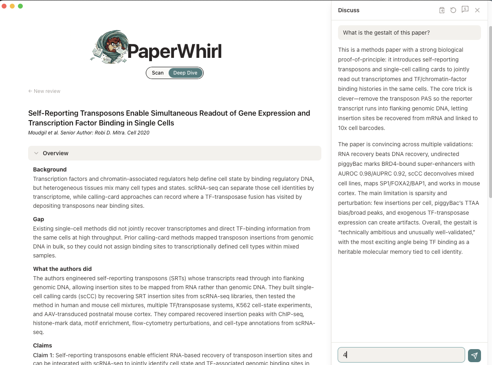
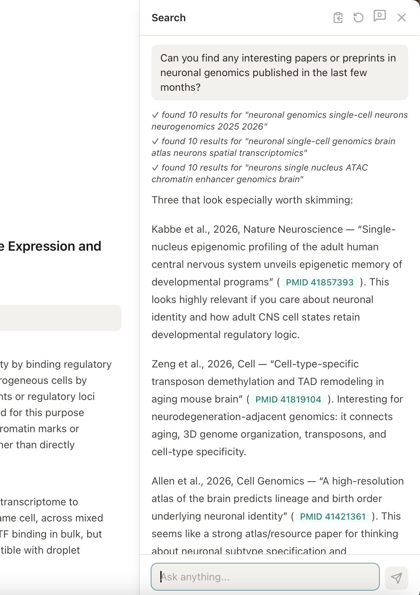
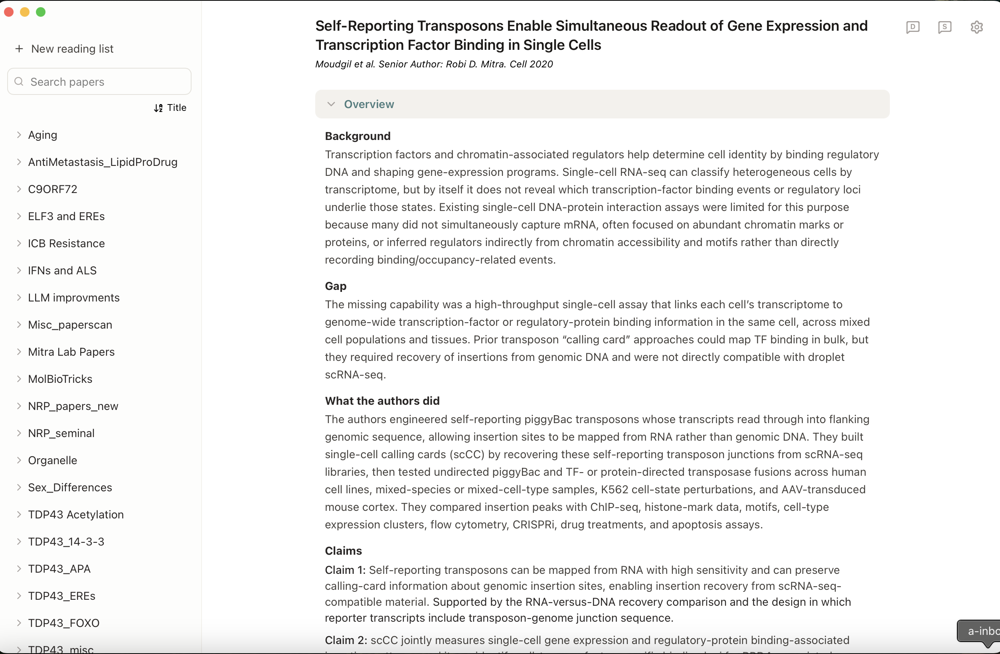
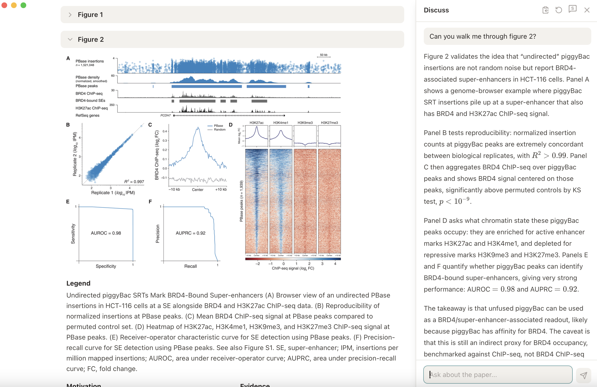
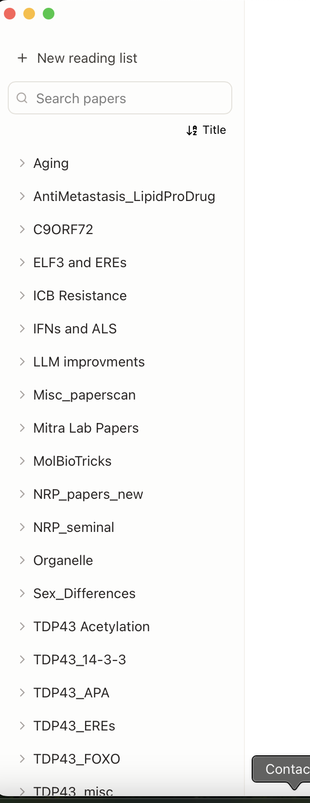
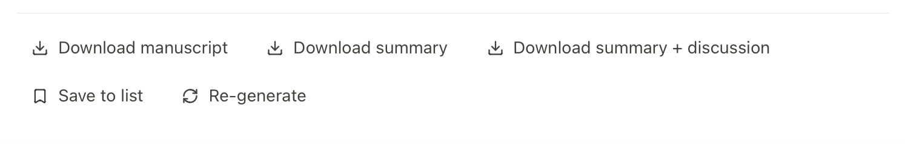

  

  <b>Fast, figure-grounded paper review for your Mac.</b> 
  Drop in a paper, get a claim-driven summary with every figure explained,
  then talk to it.

## Why PaperWhirl?

It's becoming more and more difficult to stay on top of all of the interesting
manuscripts in one's field. A good strategy to quickly extract the gestalt of a
manuscript is to read the abstract, print the figures, and have an interactive
conversation with your favorite AI. But this is still inefficient. One has to
type a prompt for every paper, print the figures for each discussion, make sure
the LLM can actually "see" the PDF properly, and keep track of old discussions.
PaperWhirl solves these problems.

## How Does PaperWhirl Work?

PaperWhirl extracts the text and figures from a manuscript, then either shows you
the abstract and figures for an instant read with no AI summary (**Scan** mode) or
generates a full AI overview and a summary of each figure (**Deep Dive** mode). Either way
it's ready to discuss the paper with you interactively. Each figure can be
unrolled individually — and clicked to **zoom** in on any panel — so you can focus
on one section of the paper at a time, and you can **highlight** passages as you
read.

To get started, just drag and drop a PDF — or paste a PMID, PMC number, bioRxiv
link, DOI, or URL — into the bar. Hit the **D** button in the top-right corner to
discuss. When you're done, you can download the full manuscript, the AI summary,
or the summary plus your discussion as a PDF, then file the paper into a reading
list for easy retrieval later.

## FAQ

### What do I need to use PaperWhirl?

- **An Apple Silicon Mac** (M1 or later).
- **An OpenAI API key.** PaperWhirl uses your own key to read and summarize
  papers — see *How do I get and enter an API key?* below. Cost ranges from a few
  cents to a few tens of cents per paper depending on the model (see
  *What does it cost?*).
- **For paywalled papers, a network with publisher access.** Open-access papers
  and preprints work from anywhere. For subscription journals, PaperWhirl can
  only fetch what your network can — so you'll want to be on your institution's
  network or VPN.

### How do I install PaperWhirl?

1. Download **PaperWhirl.zip** from the [latest release](https://github.com/The-Mitra-Lab/paperwhirl/releases/latest).
2. Unzip it.
3. Drag **PaperWhirl.app** into your **Applications** folder.
4. Open it. The first time, macOS may ask you to confirm — click **Open**.

No terminal, no Python, no other setup required.

### How do I get and enter an API key?

PaperWhirl runs on your own OpenAI API key. There are two ways to get one:

- **Bring your own key (anyone).** Create a key at the
  [OpenAI Platform](https://platform.openai.com/api-keys) — see the steps below.
- **Mitra Lab members.** Ask Rob for an invite to the lab's OpenAI project, then
  create your key inside that project so usage is billed to the lab.

**Creating your key:**

1. Sign in to the [OpenAI Platform](https://platform.openai.com/api-keys).
2. In the left sidebar, click **API keys**.
3. Make sure you're in the correct organization/project.
4. Click **Create new secret key** and give it a clear name (e.g. *PaperWhirl*).
5. **Copy the key immediately** — OpenAI only shows it once. Paste it somewhere
   safe (a password manager or a local note).

**Entering it:** open PaperWhirl and paste the key into the API-key field when
prompted. You'll also pick a folder where your papers and reading lists are
stored. That's it — the key lives only on your Mac (see *Is my API key safe?*).

### How do I use PaperWhirl?

**1. Load a paper.** Drag and drop a PDF, or paste a PMID, PMC number, bioRxiv
link, DOI, or URL into the bar. You can also click the **S** button in the
top-right to search for papers, then click a result to load it.

  

**2. Scan or Deep Dive.** A toggle under the logo switches between two modes.
**Scan** (the default) is instant and generates no AI summary — it shows the
paper's abstract plus every figure and its original legend, so it's perfect for
quick triage and costs nothing to open. (Discussing a paper with the AI still uses
your key, in either mode.) **Deep Dive** generates the full AI summary: in about
20–30 seconds you
get the overview and the figures, and the per-figure analysis finishes streaming
in over 1–2 minutes. Figures start rolled up — unroll any to read more, **click a
figure to zoom** in on a panel, and **select any text to highlight** it.

  

**3. Discuss it.** Click the **D** button in the top-right to open the discussion
panel. You can chat normally about anything in the paper — the text, the figures,
or the references; the LLM can see all of it. You don't have to wait for the full
analysis: discussion is ready as soon as the figure roll-bars appear.

  

**4. Save it to a reading list.** Hit **Save to list** to file the paper for
later. Reading lists live in the left pane. Within a list you can sort papers by
title or by date added; papers are named by first author and year by default,
but you can rename them to anything.

  

**5. Download what you need.** Three buttons let you download a PDF of the full
manuscript, the AI summary, or the summary plus your discussion.

  

### What papers and sources work?

Paste any of these into the bar, or drag in a PDF:

- A **PMID**, **PMC number**, **bioRxiv** link, **DOI**, or article **URL**
- A **PDF** dragged straight from your computer

PaperWhirl pulls the cleanest available source automatically (PubMed Central,
publisher sites, preprint servers). Open-access papers and preprints work from
anywhere; paywalled papers depend on your network having publisher access
(see *What do I need to use PaperWhirl?*).

### Is my API key safe?

Yes. Your key is stored locally on your Mac and is used only to talk to OpenAI
directly from your machine. It never leaves your computer for anywhere else —
there's no PaperWhirl server, and we never see it.

### What does it cost?

PaperWhirl itself is free — you pay only for your own OpenAI usage, and only when
PaperWhirl actually calls the AI: generating a **Deep Dive** summary, and
**discussing** a paper with the AI (in either mode). **Scan** generates no
summary, so opening and reading a paper in Scan costs nothing — you're billed only
once you Deep Dive or start a discussion. A Deep Dive on the default frontier model
typically costs on the order of tens of cents; on a cheaper tier it drops to a few
cents. Ways to keep costs down:

- **Scan first, Deep Dive selectively.** Scanning is free — triage with it, and
  only Deep Dive (or discuss) the papers worth spending on.
- **Choose a cheaper model.** PaperWhirl defaults to a frontier model for the
  best summaries, but you can switch to a cheaper tier (e.g. a *mini* or *nano*
  model) in Settings for a fraction of the cost.
- **Set a spending limit.** You can cap monthly spend on your key directly in
  the [OpenAI Platform](https://platform.openai.com/settings/organization/limits),
  so there are no surprises.
